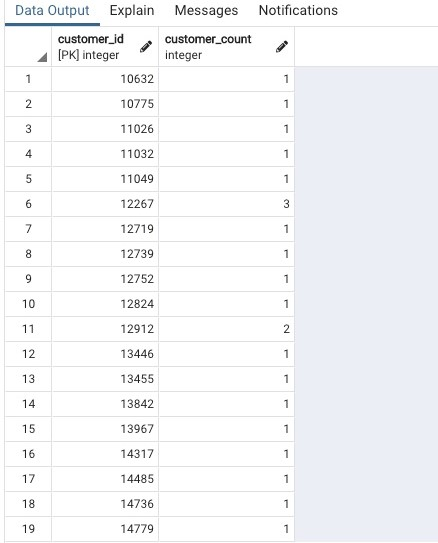
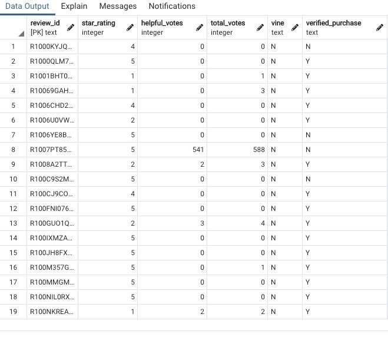
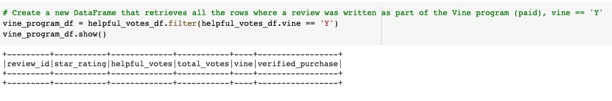

# Amazon Vine Analysis

## Overview

In this challenge, we analyzed Amazon reviews. We chose the dataset of digital video games and used PySpark to perform the ETL process to extract the dataset, transform the data, connect to an AWS RDS instance, and load the transformed data into pgAdmin. We also used PySpark to analyze if there was any bias toward favorable reviews from Vine members in this dataset.

## Resources

- Data Source: [Amazon Review datasets] (https://s3.amazonaws.com/amazon-reviews-pds/tsv/index.txt) [Amazon Reviews US Digital Video Games] (https://s3.amazonaws.com/amazon-reviews-pds/tsv/amazon_reviews_us_Digital_Video_Games_v1_00.tsv.gz)
- Software: AWS RDS, PostgreSQL 11, Google Colab Notebooks

## Results

### Perform ETL
We created four tables in pgAdmin and the final transformed data into pgAdmin was as follows:

- The customers_table

- The products_table

- The review_id_table

- The vine_table

### Bias of Vine Reviews
We intended to test if having a paid Vine review made a difference in the percentage of 5-star reviews. Our data criteria:
- The total_votes count is equal to or greater than 20.
- The number of helpful_votes divided by total_votes is equal to or greater than 50%.

The results were showing as follows:
- The final dataset description

- Reviews Analysis

Our final dataset contained 1685 reviews and 631 5-star reviews. However, there was no member of the Vine program in our dataset to share the reviews. The percentage of 5-star reviews for the non-Vine program was 37.45%.

The result cannot shed light on the bias analysis for reviews in the Vine program as there was no efficient data. The results only contained reviews from unpaid members (non-Vine program).

## Conclusion

Our sample failed to provide the bias analysis for reviews in the Vine program as there was no data after we filtered the original data. It indicated that the digital video games sample didn’t have enough paid members to write the reviews.

In this case, we can either change our data processing criteria or enlarge our dataset to redo the analysis.
